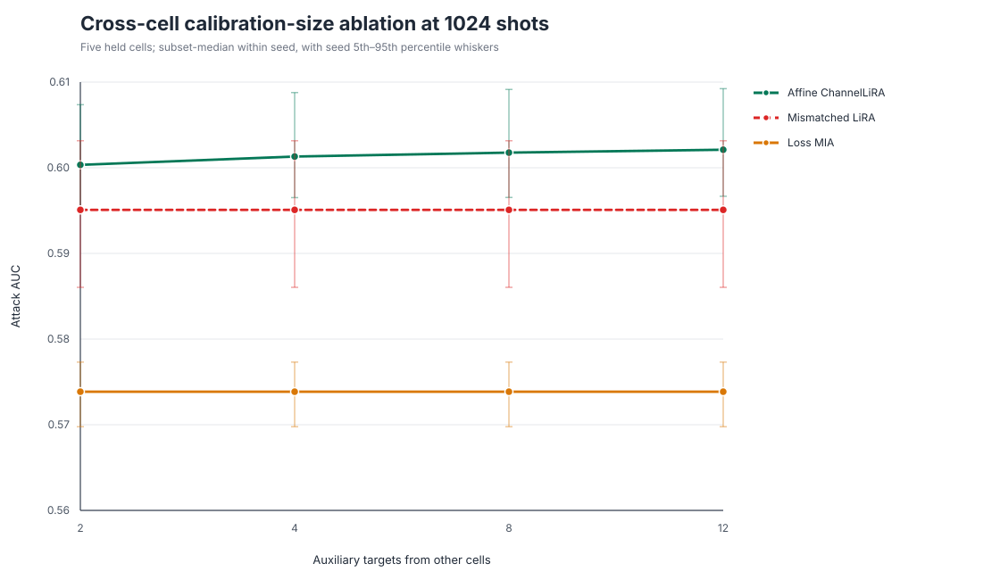
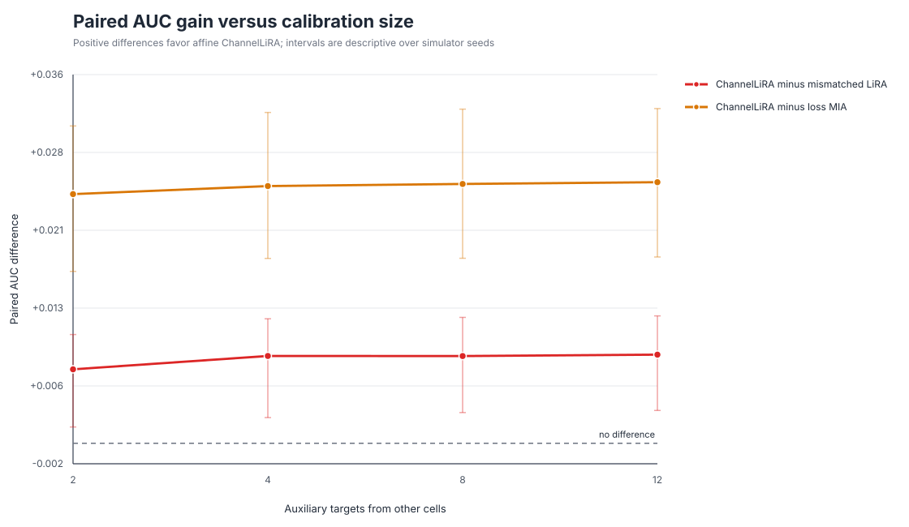
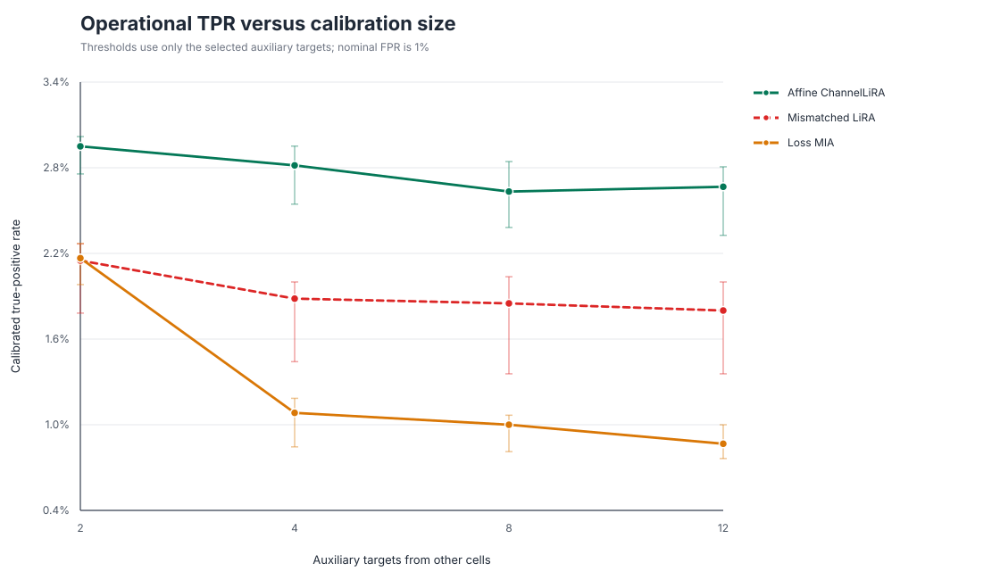
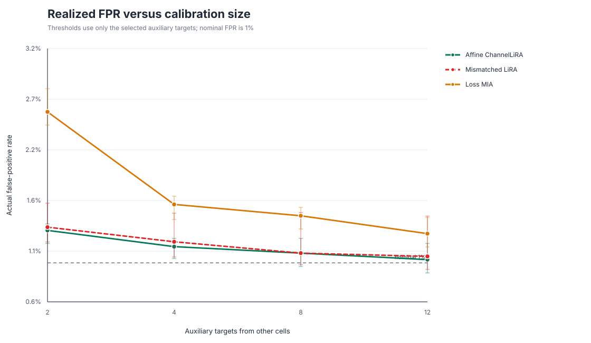
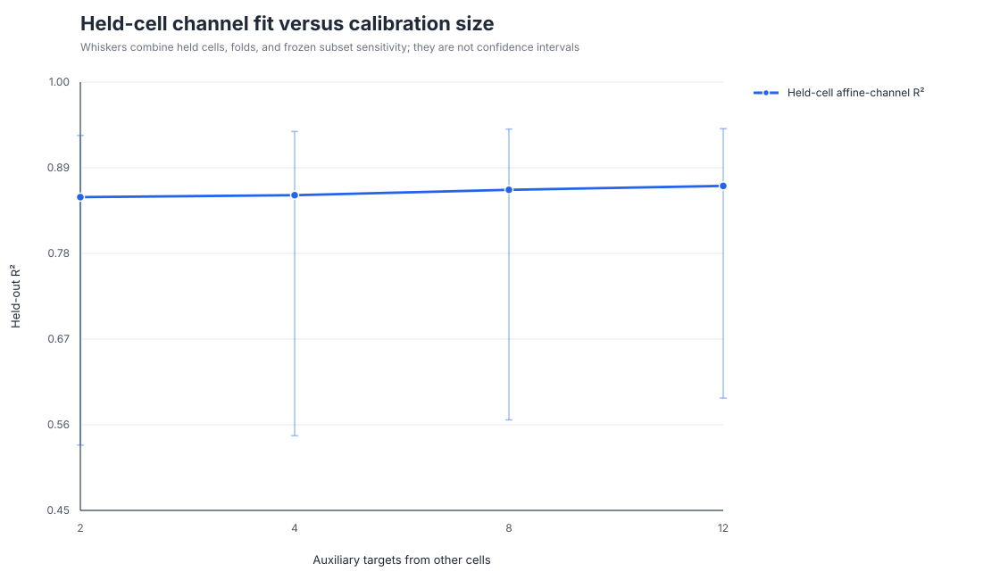
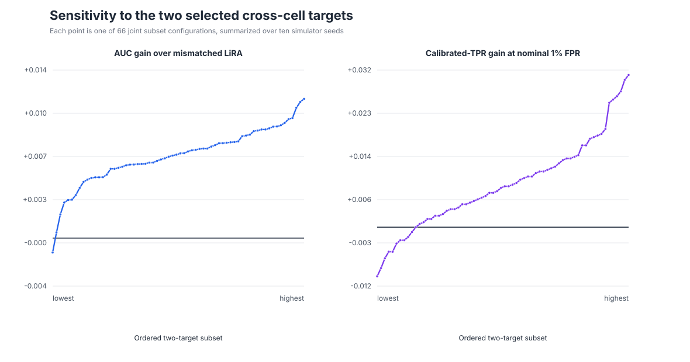

# ChannelLiRA calibration-ablation figures

## Attack AUC versus auxiliary-target count

Most of the strict-transfer AUC is already present with two cross-cell targets;
twelve targets add a small paired AUC improvement.

## Paired AUC gains

The ChannelLiRA gain over mismatched LiRA stays positive after subset marginalization
at every tested calibration count.

## Operational TPR

Two-target calibration gives higher TPR but also operates at a higher FPR than the
twelve-target condition, so it is not a free accuracy improvement.

## Realized FPR

Threshold calibration becomes more conservative and approaches the nominal 1% FPR
as more auxiliary targets are included.

## Held-cell channel fit

Median held-cell R² changes only modestly with calibration count; variation across
cells, folds, and target subsets remains wide.

## Two-target subset sensitivity

The 5th–95th percentile AUC-gain range across the 66 two-target configurations is
positive, although the weakest configurations can be negative. Operational TPR is
more sensitive to which auxiliary targets set the threshold.
