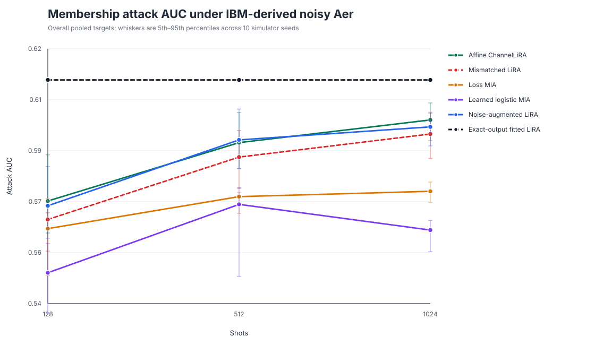
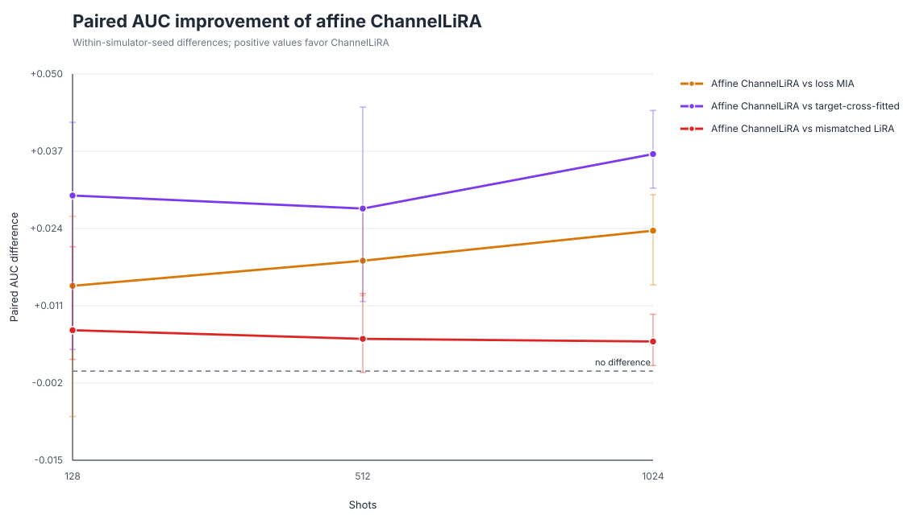
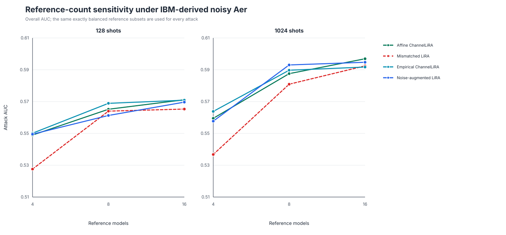
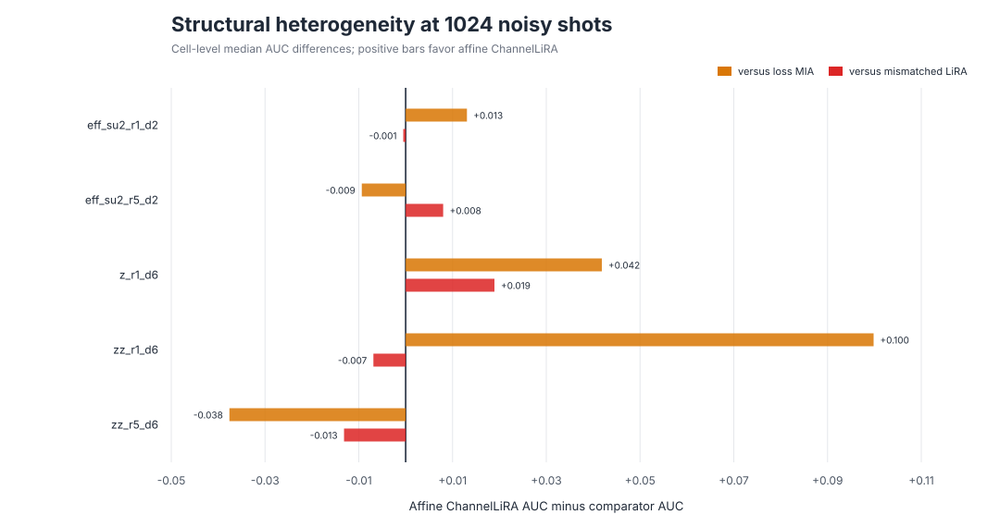
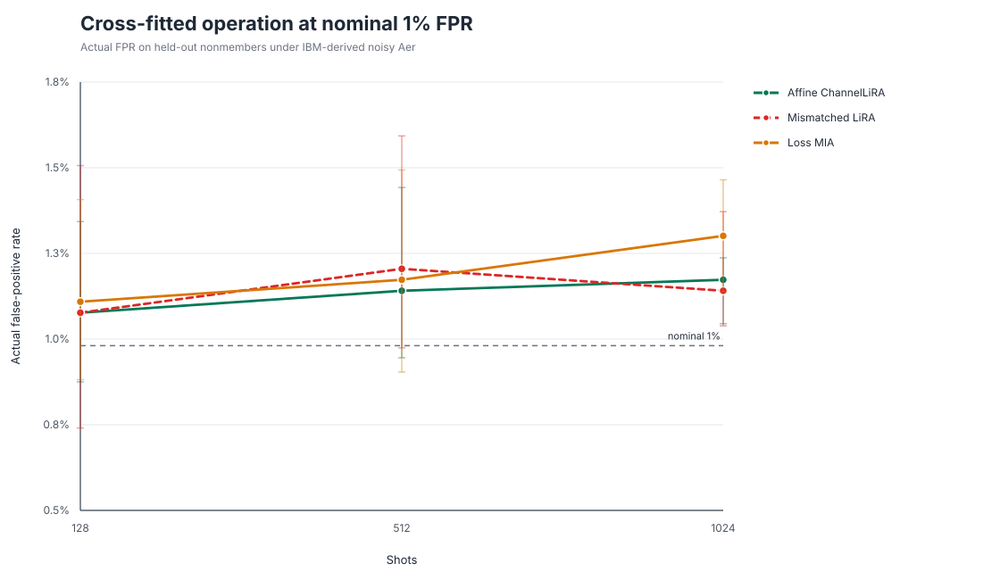
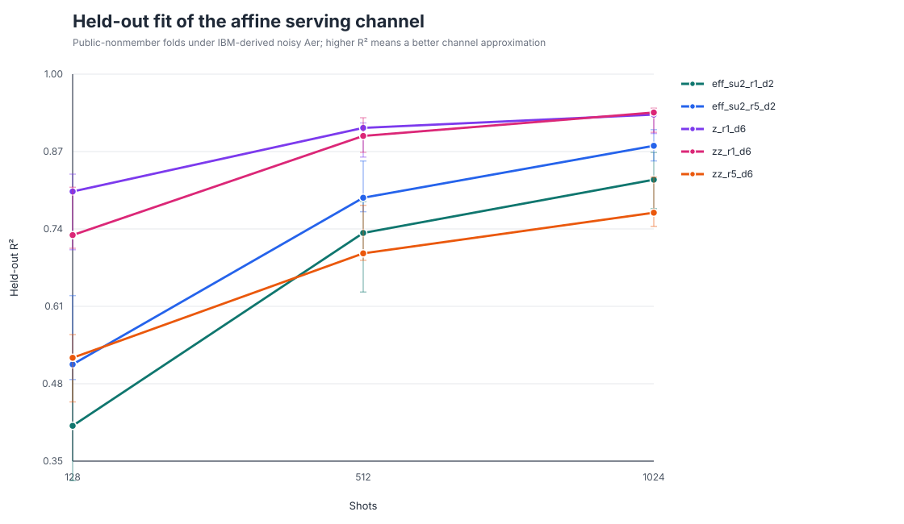

# ChannelLiRA circuit-level figures

## Attack comparison

Affine ChannelLiRA approaches the exact-output fitted-LiRA ceiling as the shot budget
increases and stays above the loss and learned baselines in the pooled result.

## Paired improvements

The 1024-shot intervals against loss, target-cross-fitted learned MIA, and
mismatched LiRA are all above zero. At 128 shots, the interval against loss crosses
zero.

## Reference-count sensitivity

The largest improvement comes from moving from four to eight reference models;
sixteen references provide the strongest affine result at 1024 shots.

## Structural heterogeneity

The pooled gain is not uniform across structural cells, which is a central gate for
the extended study.

## Fixed-FPR calibration

Cross-fitted empirical thresholds keep realized FPR close to the nominal 1% target.

## Channel-model diagnostics

The affine approximation improves sharply with shots, but the low-shot and
`zz_r5_d6` cases motivate a heteroskedastic or nonparametric extension.
