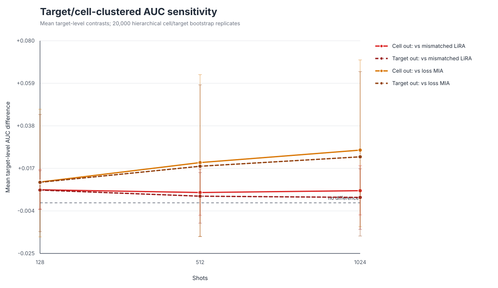

# ChannelLiRA clustered-sensitivity figure

Every hierarchical range crosses zero. This does not negate the fixed-target pooled
Phase-3 result; it shows that five cells and fifteen targets are insufficient for a
population-level architecture-generalization claim.
