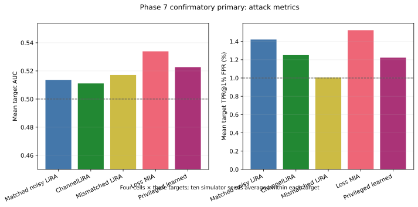
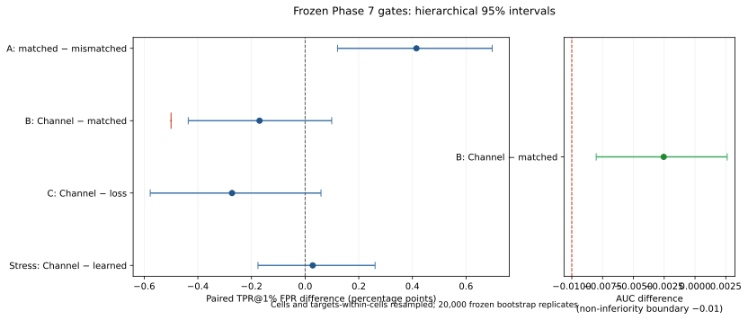

# Phase 7 Stage 2 plot index

## Confirmatory attack metrics

Bars are target-level means after averaging ten simulator seeds within each target.
They are descriptive; frozen decisions use the hierarchical paired intervals.

## Frozen gate intervals

The red marks are the frozen decision boundaries: zero for A/C, −0.5 percentage
points for B's TPR non-inferiority component, and −0.01 for B's AUC component.
The learned comparison is a privileged stress comparator and has no success gate.

- [PNG attack metrics](plots/primary_attack_metrics.png)
- [PNG gate intervals](plots/primary_gate_intervals.png)
