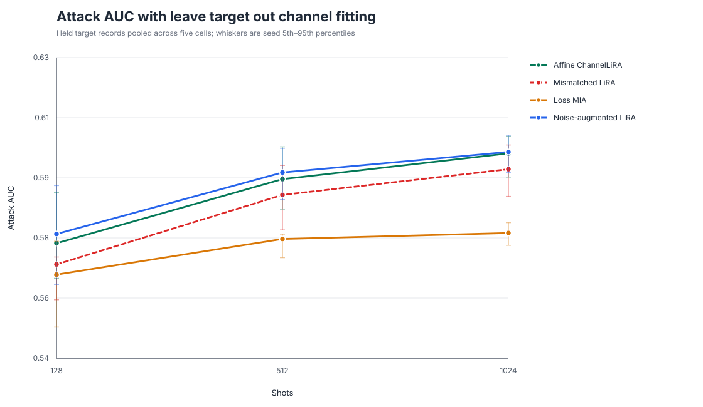
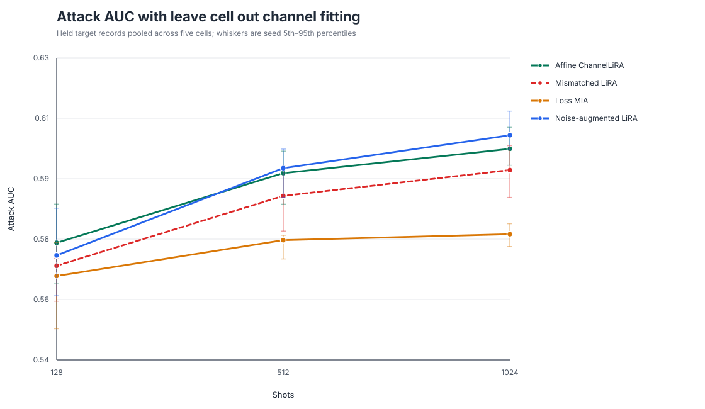
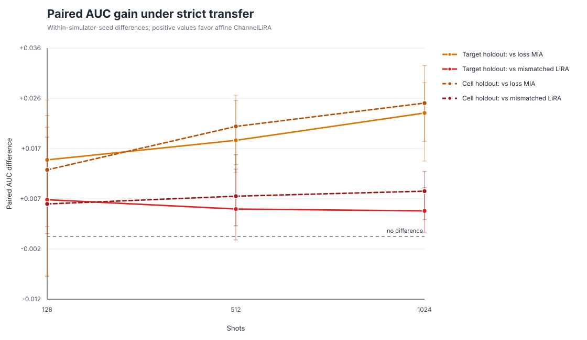
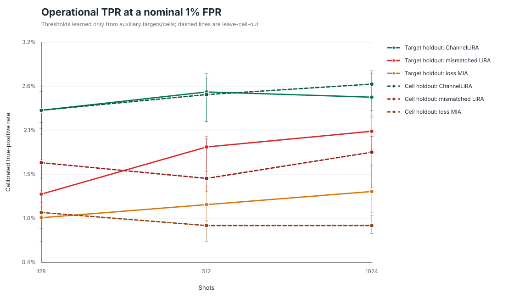
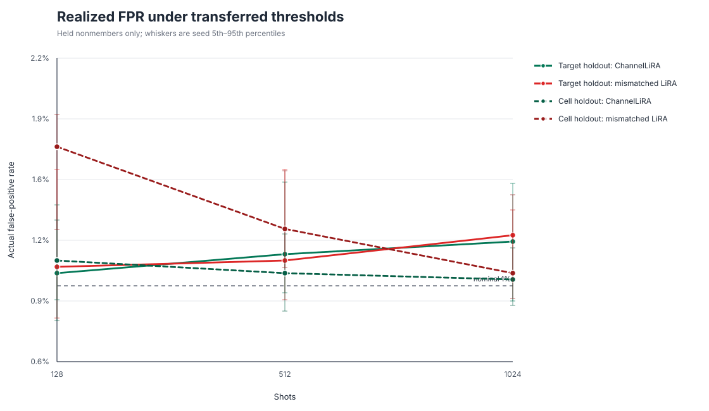
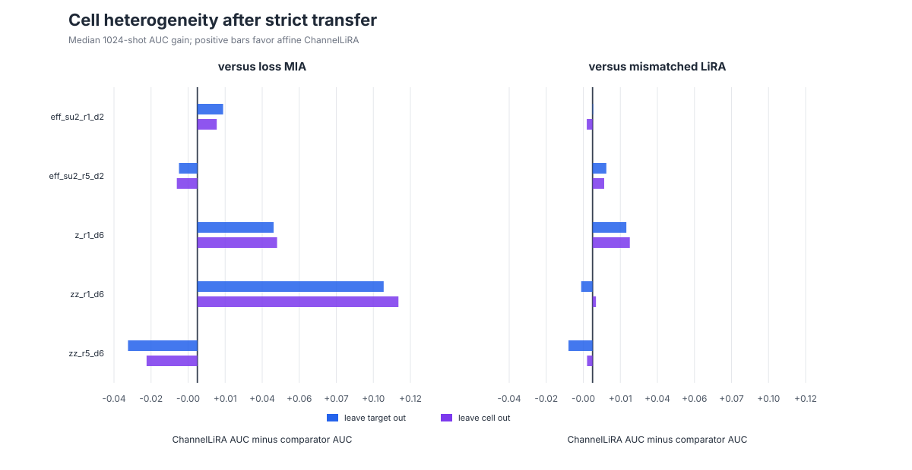
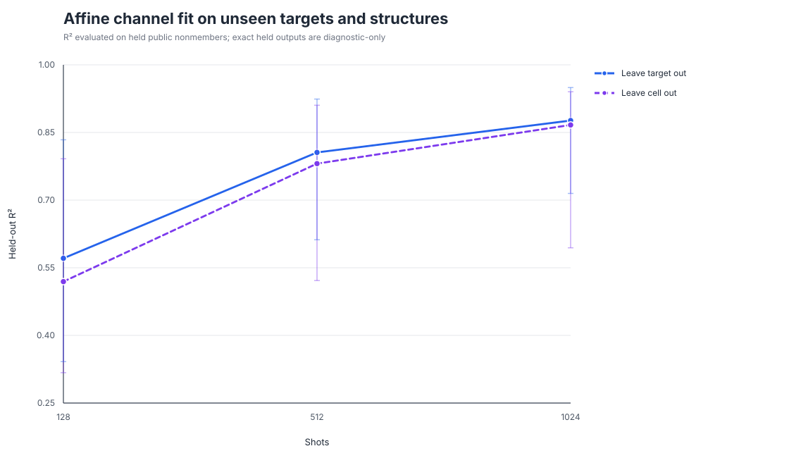

# ChannelLiRA strict-transfer figures

## Leave-target-out attack AUC

The attacked checkpoint is excluded from channel fitting and threshold calibration.

## Leave-cell-out attack AUC

Every target with the held circuit structure is excluded from channel fitting and
threshold calibration.

## Paired transfer gains

At 1024 shots, the 5th–95th percentile intervals against loss MIA and mismatched
LiRA are above zero for both holdout schemes. Target-holdout comparison with
mismatched LiRA crosses zero at 512 shots, so the evidence is not uniform by budget.

## Operational low-FPR performance

ChannelLiRA has higher transferred-threshold TPR than both primary comparators.

## FPR calibration

Actual FPR remains near 1%, though several 5th–95th percentile intervals exceed the
nominal value. These are descriptive seed intervals, not confidence intervals.

## Structural heterogeneity

Pooled superiority is not universal across the five circuit cells.

## Held-out channel diagnostics

The affine channel approximation transfers better as the shot budget grows, with
wide cell/fold variation retained in the whiskers.
